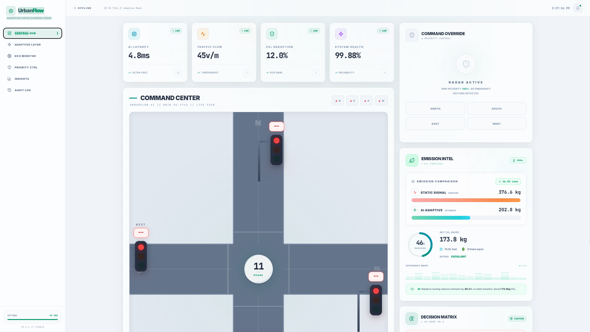
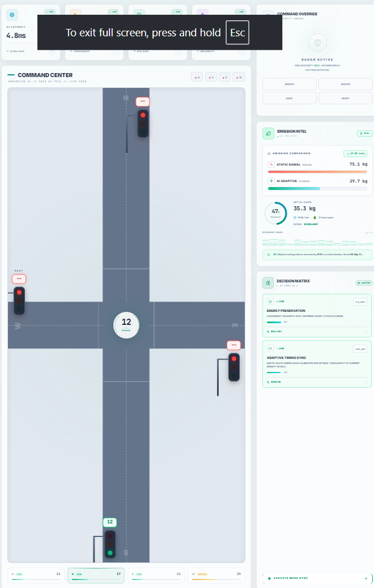
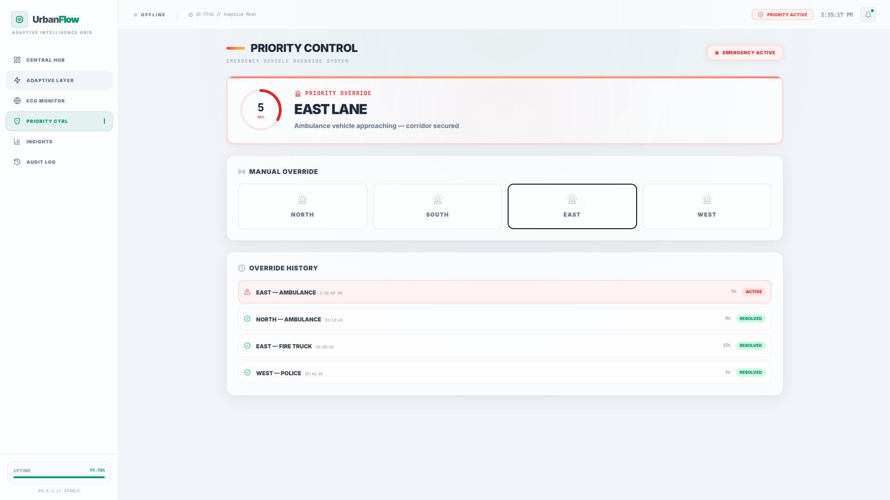
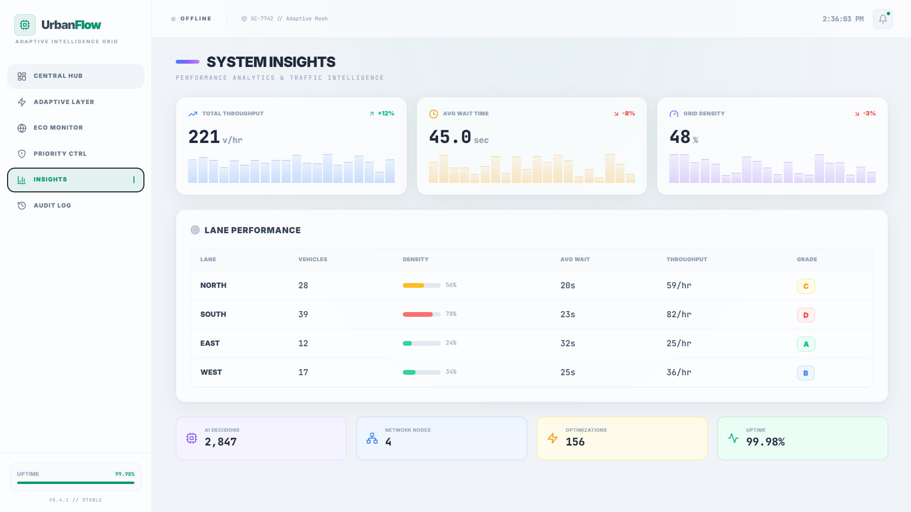
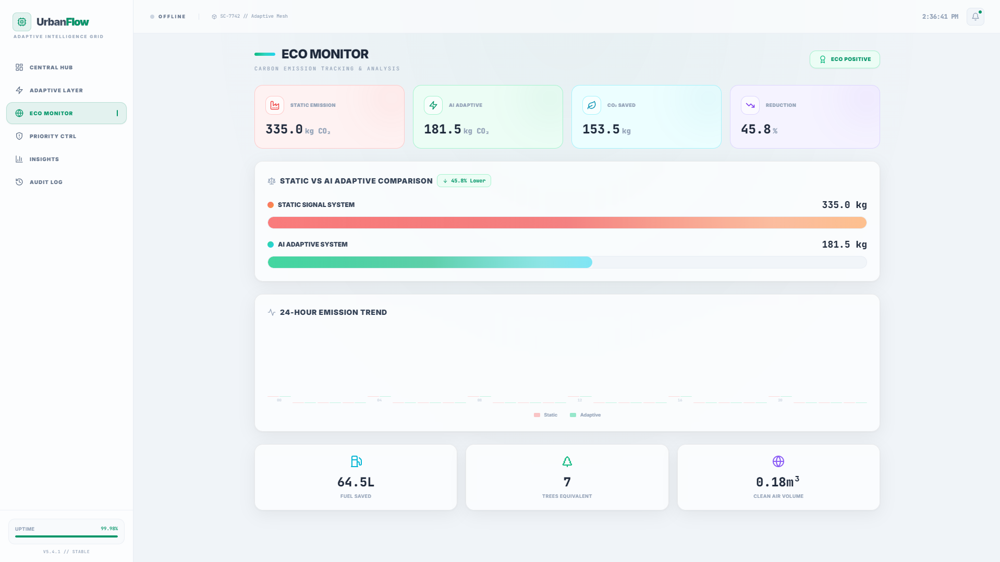

<div align="center">

# 🚦 UrbanFlow AI
### Intelligent Adaptive Traffic Management System


*A real-time, AI-powered traffic signal control system that dynamically adapts to live traffic conditions, prioritizes emergency vehicles, and minimizes CO₂ emissions.*

</div>

---

## 📌 Overview

**UrbanFlow AI** is an intelligent traffic management system designed to optimize urban traffic flow through adaptive signal control. Unlike traditional traffic systems that operate on fixed signal timings, UrbanFlow AI dynamically adjusts green signal durations based on real-time vehicle density and congestion levels across four lanes — **North, South, East, and West**.

The system continuously monitors traffic conditions, calculates optimal signal durations using an adaptive algorithm, prioritizes emergency vehicles, and estimates CO₂ emission reductions achieved through smart traffic management.

---

## 🎯 Problem Statement

Conventional traffic signal systems operate on fixed timing schedules regardless of actual traffic conditions. This often results in:

- 🚗 Increased traffic congestion
- ⏱️ Longer vehicle waiting times
- ⛽ Higher fuel consumption
- 🌫️ Increased carbon emissions
- 🚑 Delayed emergency vehicle movement

**UrbanFlow AI** addresses these challenges by implementing an adaptive traffic control mechanism that responds dynamically to changing traffic conditions in real time.

---

## 💡 Proposed Solution

UrbanFlow AI uses real-time traffic simulation and Socket.IO communication to:

- 📡 Monitor vehicle density in each lane every second
- ⏱️ Calculate adaptive green signal durations based on vehicle proportions
- 🔄 Dynamically switch active signals using smart scheduling
- 🚑 Override normal signal flow on emergency vehicle detection
- 📊 Analyze congestion levels (Low / Medium / High)
- 🌍 Estimate environmental impact through emission reduction metrics

---

## ✨ Features

### 🚦 Adaptive Signal Control
- Dynamically allocates green signal duration based on real-time traffic density
- Higher vehicle density → Longer green time; Lower density → Shorter green time
- Uses proportional adaptive algorithm with configurable base and max green times

### 📡 Real-Time Traffic Monitoring
- Live vehicle count updates every second via Socket.IO
- Congestion level detection: **Low / Medium / High**
- Density-based visual indicators across all four lanes

### 🚑 Emergency Vehicle Priority
- Detects emergency trigger events per lane
- Instantly overrides the current signal sequence
- Grants **15-second priority green** to the emergency route (Ambulance support)
- Broadcasts emergency alerts to all connected clients

### 🌍 CO₂ Emission Analysis
- Compares static vs. adaptive traffic management emission models
- Calculates estimated CO₂ savings in real time
- Displays cumulative emission reduction percentage

### 📈 Traffic Analytics Dashboard
- Live KPI cards: Active signals, avg. wait time, throughput, CO₂ saved
- Chart.js powered analytics and trend visualization
- Multi-tab sidebar: Adaptive Layer, Eco Monitor, Priority Control, Insights, Audit Log

### 🔄 Live Simulation Engine
- Simulates realistic traffic fluctuations every second
- Randomized vehicle count changes across all lanes
- Automatic signal switching with adaptive countdown

---

## 🏗️ System Architecture

```
Traffic Simulation Engine
        │
        ▼
Node.js + Express Backend (Port 5100)
        │
        ▼
Socket.IO Real-Time Communication
        │
        ▼
React + Vite Frontend Dashboard (Port 3100)
        │
        ▼
Traffic Analytics & Visualization (Chart.js + Framer Motion)
```

---

## 🛠️ Technology Stack

### 🖥️ Frontend
| Technology | Purpose |
|---|---|
| **React 18** | UI Framework |
| **Vite** | Build Tool & Dev Server |
| **Tailwind CSS** | Utility-first Styling |
| **Framer Motion** | Animations & Transitions |
| **Chart.js + React-Chartjs-2** | Data Visualization |
| **Socket.IO Client** | Real-Time Communication |
| **Lucide React** | Icon Library |

### ⚙️ Backend
| Technology | Purpose |
|---|---|
| **Node.js** | Runtime Environment |
| **Express.js** | Web Server Framework |
| **Socket.IO** | WebSocket Communication |
| **CORS** | Cross-Origin Resource Sharing |

### 🧰 Development Tools
| Tool | Purpose |
|---|---|
| **Git & GitHub** | Version Control |
| **npm** | Package Manager |
| **Nodemon** | Backend Auto-Restart |

---

## 📂 Project Structure

```
UrbanFlow-AI/
│
├── backend/
│   ├── server.js               # Express + Socket.IO server, simulation loop
│   ├── package.json
│   └── package-lock.json
│
├── frontend/
│   ├── index.html
│   ├── vite.config.js
│   ├── tailwind.config.js
│   ├── postcss.config.js
│   ├── package.json
│   └── src/
│       ├── main.jsx
│       ├── App.jsx             # Root component, socket connection
│       ├── index.css           # Global styles
│       ├── components/
│       │   ├── IntersectionCanvas.jsx   # Bird's-eye intersection view
│       │   ├── KPICards.jsx             # Live KPI metrics
│       │   ├── EmergencySystem.jsx      # Emergency vehicle panel
│       │   ├── AISuggestionsPanel.jsx   # AI recommendations
│       │   ├── CO2Comparison.jsx        # Emission reduction charts
│       │   ├── Signals.jsx              # Signal state display
│       │   ├── Vehicles.jsx             # Vehicle animation
│       │   └── tabs/
│       │       ├── AdaptiveLayerTab.jsx
│       │       ├── EcoMonitorTab.jsx
│       │       ├── PriorityControlTab.jsx
│       │       ├── InsightsTab.jsx
│       │       └── AuditLogTab.jsx
│       ├── hooks/
│       │   ├── useRafLoop.js            # RequestAnimationFrame loop
│       │   └── useSimulationLoop.js     # Simulation state hook
│       └── logic/
│           └── TrafficSimulation.js     # Client-side traffic logic
│
├── screenshots/
│   ├── dashboard-interface/
│   ├── traffic-simulation/
│   ├── emergency-vehicle-priority/
│   ├── traffic-analytics-charts/
│   └── emission-reduction-statistics/
│
├── .gitignore
└── README.md
```

---

## ⚙️ Working Mechanism

### Step 1: Traffic Monitoring
The backend simulation loop runs every **1 second**, updating vehicle counts across all four lanes (North, South, East, West) with realistic random fluctuations.

### Step 2: Density Analysis
Vehicle density is calculated per lane and categorized:
- 🟢 **Low Congestion** — density < 0.4
- 🟡 **Medium Congestion** — density 0.4–0.7
- 🔴 **High Congestion** — density > 0.7

### Step 3: Adaptive Signal Timing
Green signal duration is computed dynamically:
```
greenTime = BASE_GREEN_TIME + (lane.vehicleCount / totalVehicles) × 45
```
Capped between **15 seconds** (minimum) and **60 seconds** (maximum).

### Step 4: Emergency Handling
When an emergency vehicle is detected:
1. Current traffic sequence is **immediately overridden**
2. The emergency lane receives a **15-second priority green**
3. An `emergencyAlert` event is broadcast to all clients
4. Normal signal rotation resumes after the priority window

### Step 5: Emission Calculation
The system compares:
- **Static Model**: Fixed 30s cycles → higher idle time → more CO₂
- **Adaptive Model**: Dynamic cycles → reduced idle time → less CO₂

Savings are accumulated and displayed as a live reduction percentage.

---

## 🚀 Getting Started

### Prerequisites
- Node.js v18+
- npm v9+
- Git

### Installation & Setup

**1. Clone the repository**
```bash
git clone https://github.com/amuthanabinesh-creator/UrbanFlow-AI-Intelligent-Adaptive-Traffic-Management-System.git
cd UrbanFlow-AI-Intelligent-Adaptive-Traffic-Management-System
```

**2. Start the Backend**
```bash
cd backend
npm install
node server.js
# Backend runs on http://localhost:5100
```

**3. Start the Frontend**
```bash
cd frontend
npm install
npm run dev
# Frontend runs on http://localhost:3100
```

**4. Open in Browser**
```
http://localhost:3100
```

---

## 📸 Screenshots

### 🖥️ Dashboard Interface


### 🚦 Traffic Simulation


### 🚑 Emergency Vehicle Priority Mode


### 📊 Traffic Analytics Charts


### 🌿 Emission Reduction Statistics


---

## 📊 Expected Outcomes

| Metric | Improvement |
|---|---|
| Traffic Congestion | Significantly reduced |
| Vehicle Waiting Time | Decreased by adaptive timing |
| Emergency Response | Immediate priority routing |
| Signal Efficiency | Optimized per traffic load |
| CO₂ Emissions | Estimated reduction vs static system |
| Road Utilization | Better load distribution |

---

## 🔮 Future Enhancements

- 🤖 AI-based traffic prediction using Machine Learning
- 📷 Computer Vision vehicle detection (YOLO / OpenCV)
- 📡 IoT sensor integration for real hardware support
- ☁️ Cloud deployment (AWS / Azure / GCP)
- 📱 Mobile application support
- 🗺️ Multi-intersection traffic optimization
- 📊 Historical traffic analytics & reporting
- 🔐 Admin authentication & role-based access

---

## 🎓 Academic Relevance

This project demonstrates concepts from:

- 🏙️ Smart Cities & Urban Planning
- 🚗 Traffic Engineering
- ⚡ Real-Time Systems
- 🌐 Web Technologies (Full-Stack)
- 📊 Data Analytics & Visualization
- 🌱 Sustainable Transportation
- 🧠 Intelligent Transportation Systems (ITS)

---

<div align="center">

Made with ❤️ by [Amuthan Abinesh](https://github.com/amuthanabinesh-creator)

⭐ Star this repo if you found it helpful!

</div>
